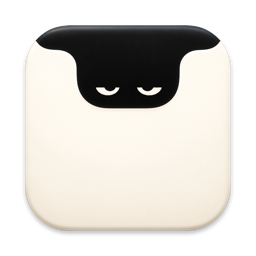
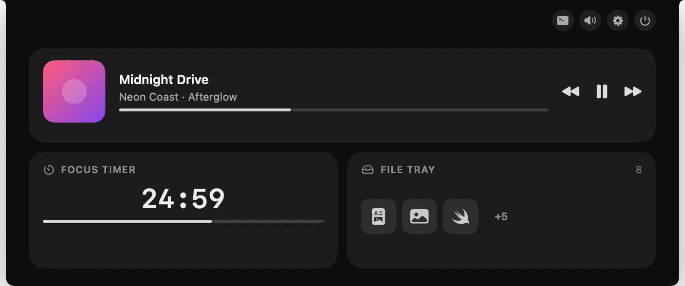
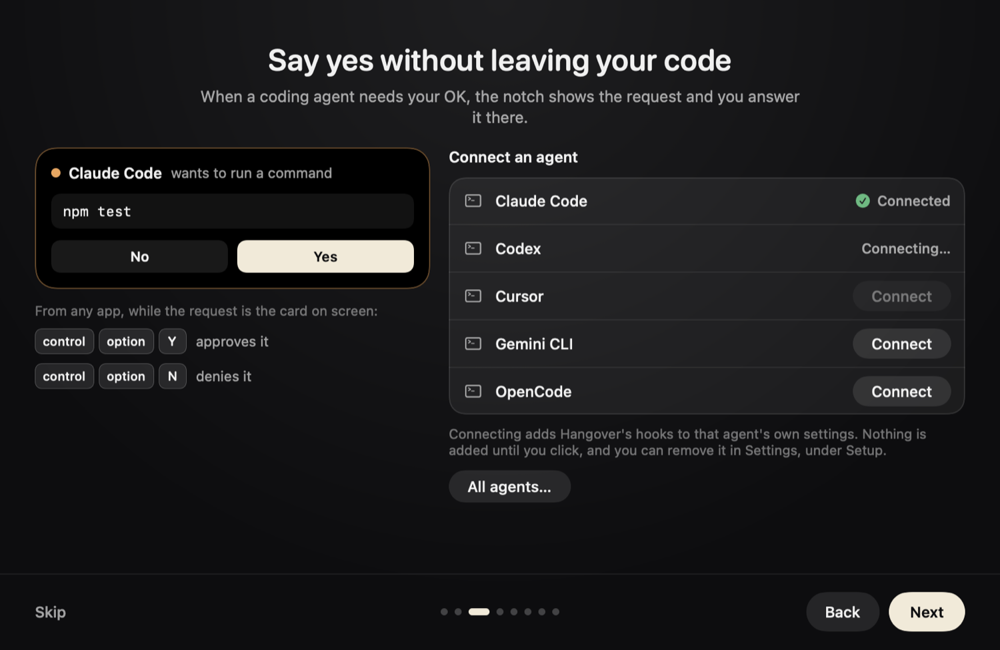
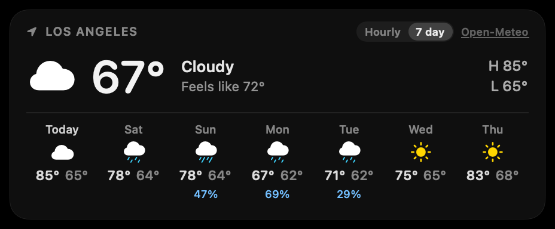
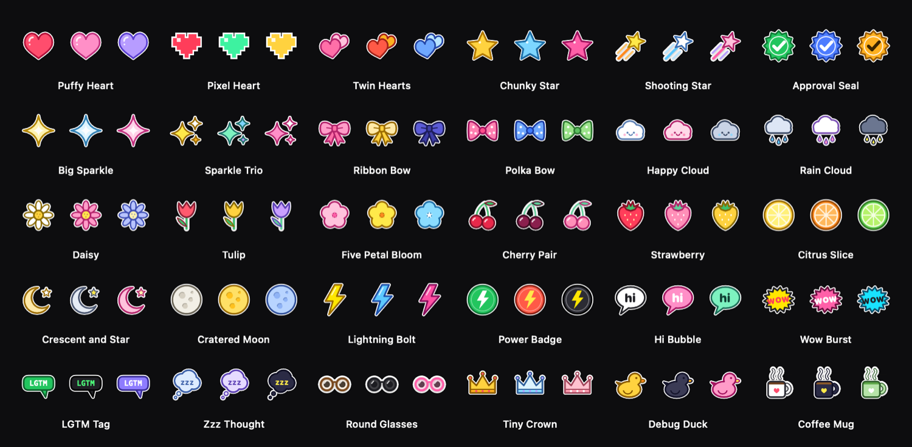
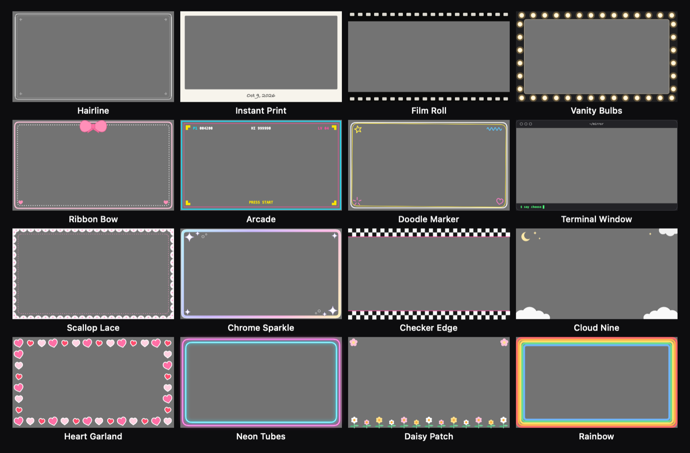
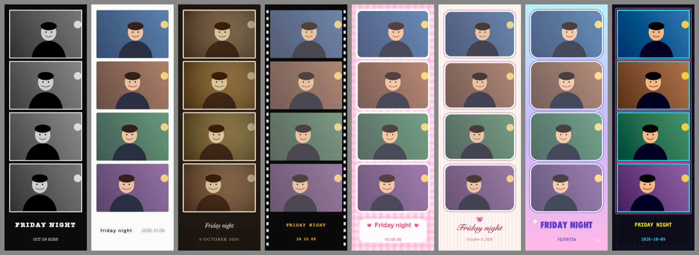
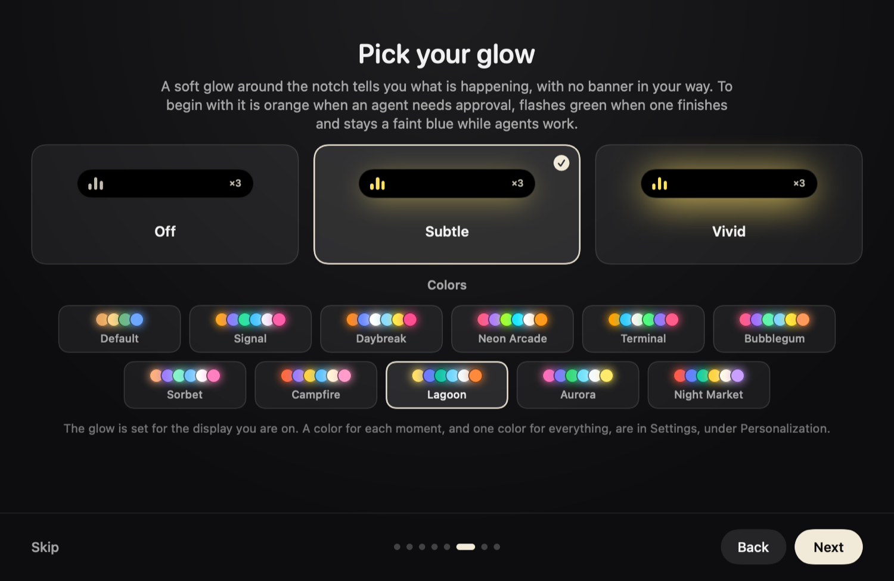
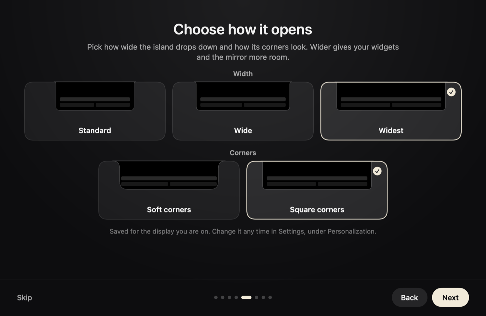

# Hangover



Hangover makes the notch on your MacBook useful. It's free and the code is all here.

After NotchNook stopped working for me, I started looking for alternatives. I ended up building my own on top of [Open Island](https://github.com/Octane0411/open-vibe-island), an open source notch app for AI coding agents.



## What's in it

**Your coding agents.** When Claude Code, Codex, Cursor or another agent needs a yes or a no, the request shows up in the notch. You can answer it right there, or press Control-Option-Y or Control-Option-N from whatever app you're in. When an agent finishes, you get one line about what it did.



**The Nook.** Open the notch and there's a page of widgets. Turn on the ones you want and drag them around.

- Music, with a scrub bar and a speaker picker
- Calendar, with a Join button when a meeting is about to start
- To-dos from Reminders or Notion
- Quick notes
- A file tray you can drop things on, with AirDrop, zip and a clipboard history
- A focus timer with pomodoro rounds
- Weather, with a 7 day view
- A mirror



Plug in your charger and the notch shows your battery as a ring.


**The mirror.** It shows your camera only when you turn it on. You can put a frame and stickers on it, turn on a ring light, or run the photo booth. The booth counts down, takes four pictures and saves the strip as a PDF, like one from a real booth.







**Your look.** You pick the colors the notch glows in, how wide it opens, and whether its corners are soft or square. A welcome tour walks you through the app the first time you open it.





The app's own tests drew these pictures, with sample content.

It comes in English, Simplified Chinese and Traditional Chinese. A native speaker hasn't checked the Chinese yet.

## Install

You need macOS 14 or later and a Mac with Apple silicon.

One thing to know first. I'm not in the Apple Developer Program, which means Apple hasn't notarized Hangover and macOS will block it the first time you open it. To open it anyway:

1. Download `Hangover.zip` from the [releases page](https://github.com/EmmanuelH05/hangover/releases) and unzip it.
2. Move Hangover to your Applications folder and double-click it. macOS shows a warning. Click **Done**.
3. Open **System Settings**, go to **Privacy & Security**, scroll down to **Security** and click **Open Anyway**. That button stays for about an hour.
4. macOS asks one more time. Confirm it.

After that it opens like any other app. Only do this with a copy you downloaded from this repo, and leave Gatekeeper on. Apple explains these steps in [Open a Mac app from an unknown developer](https://support.apple.com/guide/mac-help/open-a-mac-app-from-an-unknown-developer-mh40616/mac).

Two things come with skipping notarization. Hangover doesn't update itself, which means a new version is a new download. And macOS may ask for your permissions again after you install one.

## Build it yourself

If you build it from source, macOS opens it with no warning. You need Xcode 26 or its command line tools.

```bash
git clone --recurse-submodules https://github.com/EmmanuelH05/hangover.git
cd hangover
swift build
swift test
OPEN_ISLAND_SKIP_SMOKE_TEST=true zsh scripts/package-app.sh
```

The last line writes `output/package/Hangover.app`. Move it to Applications and open it.

A few names inside the code still say `OpenIsland`. That's on purpose: the hooks Hangover installs for your agents point at those names. `README.zh-CN.md` and most of `docs/` still belong to the original project.

## Privacy

There's no account and no analytics, and Hangover has no server of its own. Almost everything stays on your Mac. The weather tile and the Notion to-do list are the two things that go online, and only after you turn them on. The full list is in [PRIVACY_POLICY.md](PRIVACY_POLICY.md).

## Credit and license

Hangover is a changed version of [Open Island](https://github.com/Octane0411/open-vibe-island) by Octane0411 and its contributors. [NOTICE.md](NOTICE.md) says what changed.

It's free software under the [GNU General Public License, version 3](LICENSE), the same license as Open Island. You can use it, change it and pass it on under that license. It comes with no warranty.

Weather data by [Open-Meteo.com](https://open-meteo.com/).

If something breaks, [open an issue](https://github.com/EmmanuelH05/hangover/issues).
